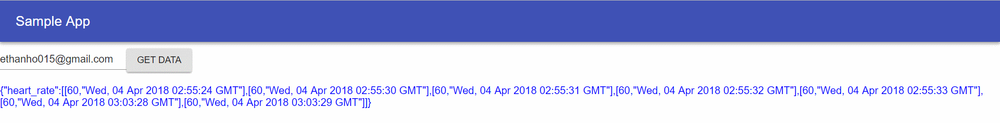

# doctor-hr-frontend

In this assignment, ReactJS was used to create a frontend viewer for the heart_rate_databases_introduction project which enabled us to store and retrieve user heart rate measurements. Currently, this viewer contains a text box which can take in an email input and do a GET request on all the user's heart rate measurements.



Before running this, make sure to use:
```
$ npm install axios
```
and
```
$ npm install material-ui@next
```
to get the necessary components.

Then to run the program, type
```
$ npm run start
```
into the command line.
